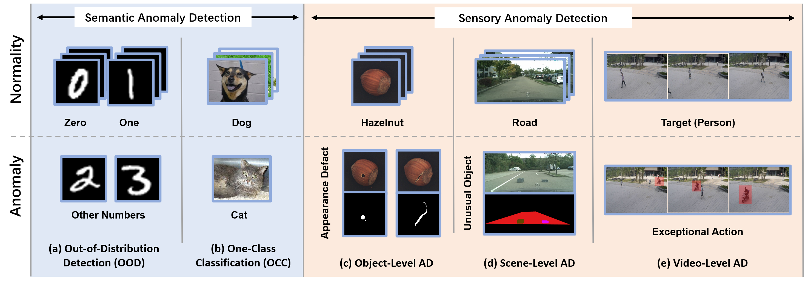

# Awesome-Visual-Sensory-Anomaly-Detection

This list is the resources of [A Survey of Visual Sensory Anomaly Detection](https://arxiv.org/abs/2202.07006). 

## What is Visual Anomaly Detection

Anomaly means a deviation from a rule or from what is regarded as standard, regular, or expected. 
The occurrence of anomalies is often challenging to predict, and the baneful influence is difficult to estimate without distinguishing them.
Anomaly Detection(AD) is an essential research topic, especially in the computer vision field. 
This review focuses on a challenging task, real-world anomaly detection in visual materials. An anomaly can be a minor defect in an industrial product, an unusual object in a driving scene, or an exceptional action in a video. 

## What is Sensory Anomaly Detection

Compared to the semantic anomaly, which is usually a manufactured accident at the level of tag categories, 
sensory anomaly is the natural matter of the senses. 
In other words, semantic anomaly refers to the whole sample(e.g., abnormal samples from different classes), while 
sensory anomaly is only a part of samples(e.g., a defect in an object).

## Awesome Researches

We collected outstanding anomaly detection papers in the last five years and classified them into three levels according to the form of anomaly. 

### 1 Object-level AD
#### 1.1 Unsupervised
+ Deep One-Class Classification via Interpolated Gaussian Descriptor [[AAAI 2022]](https://arxiv.org/abs/2101.10043)

+ CutPaste: Self-Supervised Learning for Anomaly Detection and Localization [[CVPR 2021]](http://openaccess.thecvf.com/content/CVPR2021/html/Li_CutPaste_Self-Supervised_Learning_for_Anomaly_Detection_and_Localization_CVPR_2021_paper.html)
+ A Hierarchical Transformation-Discriminating Generative Model for Few Shot Anomaly Detection [[ICCV 2021]](http://openaccess.thecvf.com/content/ICCV2021/html/Sheynin_A_Hierarchical_Transformation-Discriminating_Generative_Model_for_Few_Shot_Anomaly_Detection_ICCV_2021_paper.html)
+ DRAEM – A discriminatively trained reconstruction embedding for surface anomaly detection [[ICCV 2021]](http://openaccess.thecvf.com/content/ICCV2021/html/Zavrtanik_DRAEM_-_A_Discriminatively_Trained_Reconstruction_Embedding_for_Surface_Anomaly_ICCV_2021_paper.html)
+ Divide-and-Assemble: Learning Block-wise Memory for Unsupervised Anomaly Detection [[ICCV 2021]](http://openaccess.thecvf.com/content/ICCV2021/html/Hou_Divide-and-Assemble_Learning_Block-Wise_Memory_for_Unsupervised_Anomaly_Detection_ICCV_2021_paper.html)
+ Learning Unsupervised Metaformer for Anomaly Detection [[ICCV 2021]](http://openaccess.thecvf.com/content/ICCV2021/html/Wu_Learning_Unsupervised_Metaformer_for_Anomaly_Detection_ICCV_2021_paper.html)
+ PANDA: Adapting Pretrained Features for Anomaly Detection and Segmentation [[CVPR 2021]](http://openaccess.thecvf.com/content/CVPR2021/html/Reiss_PANDA_Adapting_Pretrained_Features_for_Anomaly_Detection_and_Segmentation_CVPR_2021_paper.html)
+ Multiresolution Knowledge Distillation for Anomaly Detection [[CVPR 2021]](http://openaccess.thecvf.com/content/CVPR2021/html/Salehi_Multiresolution_Knowledge_Distillation_for_Anomaly_Detection_CVPR_2021_paper.html)
+ Learning Semantic Context from Normal Samples for Unsupervised Anomaly Detection [[AAAI 2021]](https://www.aaai.org/AAAI21Papers/AAAI-4221.YanX.pdf)

+ Same Same But DifferNet: Semi-Supervised Defect Detection with Normalizing Flows [[WACV 2021]](http://openaccess.thecvf.com/content/WACV2021/html/Rudolph_Same_Same_but_DifferNet_Semi-Supervised_Defect_Detection_With_Normalizing_Flows_WACV_2021_paper.html)
+ Glancing at the Patch: Anomaly Localization with Global and Local Feature Comparison [[CVPR 2021]](http://openaccess.thecvf.com/content/CVPR2021/html/Wang_Glancing_at_the_Patch_Anomaly_Localization_With_Global_and_Local_CVPR_2021_paper.html)

+ Uninformed Students: Student–Teacher Anomaly Detection with Discriminative Latent Embeddings [[CVPR 2020]](http://openaccess.thecvf.com/content_CVPR_2020/html/Bergmann_Uninformed_Students_Student-Teacher_Anomaly_Detection_With_Discriminative_Latent_Embeddings_CVPR_2020_paper.html)
+ Encoding Structure-Texture Relation with P-Net for Anomaly Detection in Retinal Images [[ECCV 2020]](https://link.springer.com/chapter/10.1007/978-3-030-58565-5_22)
+ Iterative energy-based projection on a normal data manifold for anomaly localization [[ICLR 2020]](https://openreview.net/forum?id=HJx81ySKwr)
+ Consistent estimation of the max-flow problem: Towards unsupervised image segmentation [[TPAMI 2020]](https://ieeexplore.ieee.org/abstract/document/9266102/)

#### 1.2 Weakly Supervised
+ Explainable Deep One-Class Classification [[ICLR 2021]](https://openreview.net/forum?id=A5VV3UyIQz)
+ Few-shot domain-adaptive anomaly detection for cross-site brain images [[TPAMI 2021]](https://ieeexplore.ieee.org/abstract/document/9606561/)

+ Neural Batch Sampling with Reinforcement Learning for Semi-Supervised Anomaly Detection [[ECCV 2020]](https://www.ecva.net/papers/eccv_2020/papers_ECCV/papers/123710749.pdf)
+ Attention Guided Anomaly Localization in Images [[ECCV 2020]](https://www.ecva.net/papers/eccv_2020/papers_ECCV/papers/123620477.pdf)

+ Multistage GAN for Fabric Defect Detection [[TIP 2019]](https://ieeexplore.ieee.org/abstract/document/8937049/)
+ Learning Fixed Points in Generative Adversarial Networks: From Image-to-Image Translation to Disease Detection and Localization [[ICCV 2019]](http://openaccess.thecvf.com/content_ICCV_2019/html/Siddiquee_Learning_Fixed_Points_in_Generative_Adversarial_Networks_From_Image-to-Image_Translation_ICCV_2019_paper.html)

+ Domain Adaptation for Automatic OLED Panel Defect Detection Using Adaptive Support Vector Data Description [[IJCV 2017]](https://link.springer.com/article/10.1007/s11263-016-0953-y)

#### 1.3 Supervised
+ Interleaved Deep Artifacts-Aware Attention Mechanism for Concrete Structural Defect Classification [[TIP 2021]](https://ieeexplore.ieee.org/abstract/document/9505264/)

+ Reference-Based Defect Detection Network [[TIP 2021]](https://ieeexplore.ieee.org/abstract/document/9490526/)
+ Fabric defect detection using tactile information [[ICRA 2021]](https://ieeexplore.ieee.org/abstract/document/9561092/)

+ Deep Neural Network based Visual Inspection with 3D Metric Measurement of Concrete Defects using Wall-climbing Robot [[IROS 2019]](https://ieeexplore.ieee.org/abstract/document/8968195/)
### 2 Scene-level AD
#### 2.1 Weakly Supervised

+ Pixel-wise Anomaly Detection in Complex Driving Scenes [[CVPR 2021]](http://openaccess.thecvf.com/content/CVPR2021/html/Di_Biase_Pixel-Wise_Anomaly_Detection_in_Complex_Driving_Scenes_CVPR_2021_paper.html)
+ Road Anomaly Detection by Partial Image Reconstruction with Segmentation Coupling [[ICCV 2021]](http://openaccess.thecvf.com/content/ICCV2021/html/Vojir_Road_Anomaly_Detection_by_Partial_Image_Reconstruction_With_Segmentation_Coupling_ICCV_2021_paper.html)
+ Detection and Retrieval of Out-of-Distribution Objects in Semantic Segmentation [[CVPR 2020]](http://openaccess.thecvf.com/content_CVPRW_2020/html/w20/Oberdiek_Detection_and_Retrieval_of_Out-of-Distribution_Objects_in_Semantic_Segmentation_CVPRW_2020_paper.html)
+ Synthesize Then Compare: Detecting Failures and Anomalies for Semantic Segmentation [[ECCV 2020]](https://link.springer.com/chapter/10.1007/978-3-030-58452-8_9)

+ Detecting the Unexpected via Image Resynthesis [[ICCV 2019]](http://openaccess.thecvf.com/content_ICCV_2019/html/Lis_Detecting_the_Unexpected_via_Image_Resynthesis_ICCV_2019_paper.html)
+ Detecting Unexpected Obstacles for Self-Driving Cars: Fusing Deep Learning and Geometric Modeling[[VI 2017]](https://ieeexplore.ieee.org/abstract/document/7995849/)

#### 2.2 Supervised
+ SegmentMeIfYouCan: A Benchmark for Anomaly Segmentation [[NeurIPS 2021]](https://openreview.net/forum?id=OFiGmksrSz1)

+ Real-Time Fusion Network for RGB-D Semantic Segmentation Incor- porating Unexpected Obstacle Detection for Road-Driving Images [[RAL 2020]](https://ieeexplore.ieee.org/abstract/document/9134735/)
+ A Novel Multi-layer Framework for Tiny Obstacle Discovery [[ICRA 2019]](https://ieeexplore.ieee.org/abstract/document/8794279/)
+ MergeNet: A Deep Net Architecture for Small Obstacle Discovery [[ICRA 2018]](https://ieeexplore.ieee.org/abstract/document/8461065/)

### 3 Event-level AD
#### 3.1 Unsupervised
+ Future Frame Prediction Network for Video Anomaly Detection [[TPAMI 2021]](https://ieeexplore.ieee.org/abstract/document/9622181/)
+ Context-Dependent Anomaly Detection for Low Altitude Traffic Surveillance [[ICRA 2021]](https://ieeexplore.ieee.org/abstract/document/9562043/)

+ Graph Embedded Pose Clustering for Anomaly Detection [[CVPR 2020]](http://openaccess.thecvf.com/content_CVPR_2020/html/Markovitz_Graph_Embedded_Pose_Clustering_for_Anomaly_Detection_CVPR_2020_paper.html)
+ Learning Memory-guided Normality for Anomaly Detection [[CVPR 2020]](http://openaccess.thecvf.com/content_CVPR_2020/html/Park_Learning_Memory-Guided_Normality_for_Anomaly_Detection_CVPR_2020_paper.html)
+ Self-trained Deep Ordinal Regression for End-to-End Video Anomaly Detection [[CVPR 2020]](http://openaccess.thecvf.com/content_CVPR_2020/html/Pang_Self-Trained_Deep_Ordinal_Regression_for_End-to-End_Video_Anomaly_Detection_CVPR_2020_paper.html)
+ Clustering Driven Deep Autoencoder for Video Anomaly Detection [[ECCV 2020]](https://link.springer.com/chapter/10.1007/978-3-030-58555-6_20)
+ Quantifying and Detecting Collective Motion in Crowd Scenes [[TIP 2020]](https://ieeexplore.ieee.org/abstract/document/9062523/)

+ Memorizing Normality to Detect Anomaly: Memory-augmented Deep Autoencoder for Unsupervised Anomaly Detection [[ICCV 2019]](http://openaccess.thecvf.com/content_ICCV_2019/html/Gong_Memorizing_Normality_to_Detect_Anomaly_Memory-Augmented_Deep_Autoencoder_for_Unsupervised_ICCV_2019_paper.html)
+ Object-centric Auto-encoders and Dummy Anomalies for Abnormal Event Detection in Video [[CVPR 2019]](http://openaccess.thecvf.com/content_CVPR_2019/html/Ionescu_Object-Centric_Auto-Encoders_and_Dummy_Anomalies_for_Abnormal_Event_Detection_in_CVPR_2019_paper.html)
+ Learning Regularity in Skeleton Trajectories for Anomaly Detection in Videos [[CVPR 2019]](http://openaccess.thecvf.com/content_CVPR_2019/html/Morais_Learning_Regularity_in_Skeleton_Trajectories_for_Anomaly_Detection_in_Videos_CVPR_2019_paper.html)
+ Anomaly Detection in Video Sequence with Appearance-Motion Correspondence [[ICCV 2019]](http://openaccess.thecvf.com/content_ICCV_2019/html/Nguyen_Anomaly_Detection_in_Video_Sequence_With_Appearance-Motion_Correspondence_ICCV_2019_paper.html)
+ A Background-Agnostic Framework with Adversarial Training for Abnormal Event Detection in Video [[TPAMI 2020]](https://arxiv.org/abs/2008.12328)

+ Domain-Transformable Sparse Representation for Anomaly Detection in Moving-Camera Videos [[TIP 2019]](https://ieeexplore.ieee.org/abstract/document/8839745/)
+ Unsupervised Traffic Accident Detection in First-Person Videos [[IROS 2019]](https://ieeexplore.ieee.org/abstract/document/8967556/)

+ Detecting Regions of Maximal Divergence for Spatio-Temporal Anomaly Detection [[TPAMI 2018]](https://ieeexplore.ieee.org/abstract/document/8352745/)

+ Deep-Cascade: Cascading 3D Deep Neural Networks for Fast Anomaly Detection and Localization in Crowded Scenes [[TIP 2017]](https://ieeexplore.ieee.org/abstract/document/7858798/)
#### 3.2 Weakly Supervised

+ Dance with Self-Attention: A New Look of Conditional Random Fields on Anomaly Detection in Videos [[ICCV 2021]](http://openaccess.thecvf.com/content/ICCV2021/html/Purwanto_Dance_With_Self-Attention_A_New_Look_of_Conditional_Random_Fields_ICCV_2021_paper.html)
+ Weakly-supervised Video Anomaly Detection with Robust Temporal Feature Magnitude Learning [[ICCV 2021]](http://openaccess.thecvf.com/content/ICCV2021/html/Tian_Weakly-Supervised_Video_Anomaly_Detection_With_Robust_Temporal_Feature_Magnitude_Learning_ICCV_2021_paper.html)
+ Weakly-Supervised Spatio-Temporal Anomaly Detection in Surveillance Video [[IJCAI 2021]](https://www.ijcai.org/proceedings/2021/0162.pdf)
+ Learning Causal Temporal Relation and Feature Discrimination for Anomaly Detection [[TIP 2021]](https://ieeexplore.ieee.org/abstract/document/9369126/)
+ CLAWS: Clustering Assisted Weakly Supervised Learning with Normalcy Suppression for Anomalous Event Detection [[ECCV 2020]](https://link.springer.com/chapter/10.1007/978-3-030-58542-6_22)

+ Margin Learning Embedded Prediction for Video Anomaly Detection with A Few Anomalies [[IJCAI 2019]](https://www.ijcai.org/proceedings/2019/0419.pdf)
+ Graph Convolutional Label Noise Cleaner: Train a Plug-and-play Action Classifier for Anomaly Detection [[CVPR 2019]](http://openaccess.thecvf.com/content_CVPR_2019/html/Zhong_Graph_Convolutional_Label_Noise_Cleaner_Train_a_Plug-And-Play_Action_Classifier_CVPR_2019_paper.html)
+ Localizing Anomalies From Weakly-Labeled Videos [[TIP 2021]](https://ieeexplore.ieee.org/abstract/document/9408419/)
+ Real-world Anomaly Detection in Surveillance Videos [[CVPR 2018]](http://openaccess.thecvf.com/content_cvpr_2018/html/Sultani_Real-World_Anomaly_Detection_CVPR_2018_paper.html)

#### 3.3 Supervised

+ A Hybrid Video Anomaly Detection Framework via Memory-Augmented Flow Reconstruction and Flow-Guided Frame Prediction [[ICCV 2021]](http://openaccess.thecvf.com/content/ICCV2021/html/Liu_A_Hybrid_Video_Anomaly_Detection_Framework_via_Memory-Augmented_Flow_Reconstruction_ICCV_2021_paper.html)
+ Variational Abnormal Behavior Detection With Motion Consistency [[TIP 2021]](https://ieeexplore.ieee.org/abstract/document/9633236/)

+ A Revisit of Sparse Coding Based Anomaly Detection in Stacked RNN Framework [[ICML 2019]](http://openaccess.thecvf.com/content_iccv_2017/html/Luo_A_Revisit_of_ICCV_2017_paper.html)
+ Exploiting Typicality for Selecting Informative and Anomalous Samples in Videos [[TIP 2019]](https://ieeexplore.ieee.org/abstract/document/8693693/)
+ Video Anomaly Detection with Sparse Coding Inspired Deep Neural Networks [[TPAMI 2019]](https://ieeexplore.ieee.org/abstract/document/8851288/)
+ Fast Abnormal Event Detection [[IJCV 2019]](https://idp.springer.com/authorize/casa?redirect_uri=https://link.springer.com/article/10.1007/s11263-018-1129-8&casa_token=-h5zJP3S09wAAAAA:WK2dlVjvS0bawTjEekAP87cK42Nq6EqfZC63geAfbEMs5mCLax4tD0NFLqNdabzMinM5o5SRxxf_3Ow73Uk)
+ Future frame prediction for anomaly detection–a new baseline [[CVPR 2018]](http://openaccess.thecvf.com/content_cvpr_2018/html/Liu_Future_Frame_Prediction_CVPR_2018_paper.html)
+ Video Anomaly Detection With Compact Feature Sets for Online Performance [[TIP 2017]](https://ieeexplore.ieee.org/abstract/document/7903693/)

